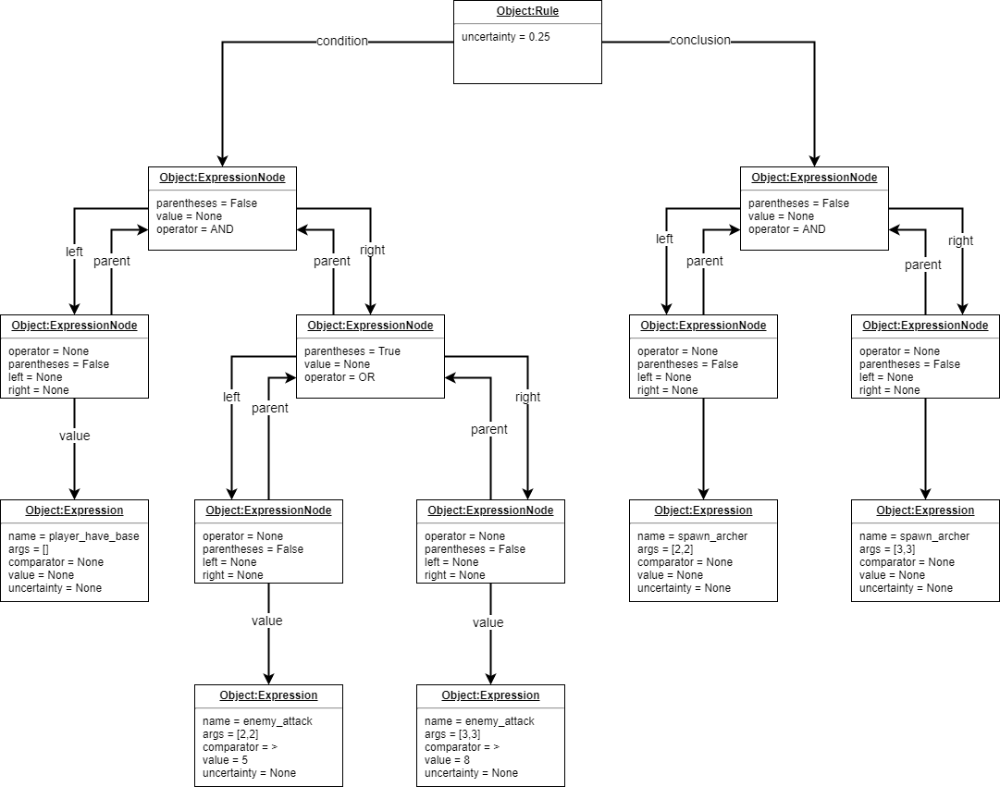

Expert system
===================

Main module of Orodael Turrim is expert system. Your task is to create your own planning expert system that will
plan defence against Rigor Mortis.  All behaviour of expert system is extracted to ``User`` module, so you don't
need to change anything in program code.

Also it is forbidden to change anything in other parts of the code. Tests of the Expert system will be executed
with the original modules, only with you ``User`` module, so any other changes will be ignored.

Structure of the expert system is divided to 3 parts:

* ``KnowledgeBase.py`` - part of module for creating knowledge based on game state
* ``Interference.py`` - part of module for inference mechanism
* ``ActionBase.py`` - part of module for defining conclusions and actions of conclusions

You need to implement all three parts to achieve working expert system. As an example, there is already implemented
basic version of inference, but did not support all necessary function, so use that example only for
inspiration.

.. warning::

   When you are creating expert system, there are few restrictions for implementation. If you violate these
   restrictions, your solution will ne be accepted.

Knowledge base
-----------------

First part that your should implement is ``KnowledgeBase``. In this part of module you should get all necessary
information from proxy and transform those information to Facts. Those fact you will use in inference mechanism.

It is recommended to use ``ExpertSystem.Structure.RuleBase.Fact`` class to represent facts. Class ``Fact`` have
``name`` attribute for identification, ``probability`` parameter for save uncertainty of a fact and ``eval_function``.
Eval function is Python callable object, which determinate fact value. In the inference module, if you want to use
comparators, you need to get value of the Fact. For this purpose you should use ``eva_function``.

If you didn't specify ``eval_function``, default value is True ( just Fact exists ). Otherwise you can specify any
callable object as eval_function. For example you can provide to the callable list of enemies strengths and then
evaluate it based on rules.

.. code-block:: python

   # KnowledgeBase
   attacks = {('0', '0'): 5, ('1', '0'): 8}
   facts.append(Fact('unit_attack', lambda x, y: attacks[(x, y)]))

   # Rules
   IF unit_attack 0 0 > 4 THEN build_base 0 0;

It is up to you, how you specify facts, you can use your own representation.

For creating knowledge base you could use 3 types of proxy:

* ``MapProxy`` - access information about map
* ``GameObjectProxy`` - access information about game objects
* ``GameUncertaintyProxy`` - access information about uncertainty spawns

You can read more about proxy methods at **TODO**

List of the facts that you generate in ``KnowledgeBase.create_knowledge_base`` will be passed to inference method.

.. warning::

    For creating facts use only proxy! Don't try to get more information from the GameEngine itself!

Interference
--------------

In the inference part of the module you should define your inference method. You could use forward or backward
inference. Whole inference implementation is up to you. You must implement inference in ``interfere`` method,
because this method will me executed each round in the game. Of course, you can implement other supported
function for better code structure, but entry point must be ``interfere`` method. Don't change the signature
of the ``interfere`` method, your will never call inference directly. ``interfere`` method provides parameters:

* ``knowledge_base`` - list of facts from ``KnowledgeBase.create_knowledge_base``
* ``rules`` - list of rules from rules files in tree representation
* ``action_base`` - instance of action base for calling conclusions

**Rules structure**

Framework will parse rules file for you. You will get rules as a list of ``ExpertSystem.Structure.RuleBase.Rule``
instances. Each list item represent one rule. You can read about rule structure at :ref:`rules`.

**Interference method**

In the ``User`` module is example of basic inference method. This is very simple and useless implementation of
inference. Use it only as example. As the result of the inference you should call some action from ``ActionBase``.

**Action base calls**

In the inference method you have access to ``ActionBase`` instance. First you need to have some actions defined in
``ActionBase``. Then you can call them from the inference module. You can use overloaded __getitem__ method for
call methods. If you pass ``str`` value, function will be called if exists without any parameters. If you use
``Expression`` class, name of the expression will be used as name and also arguments will be passed to the
call of method. You can also call methods directly with your own method.

Action base
--------------

In the action base, you can specify your own conclusions with your own implementation. Just write new method to
``ActionBase``. Your methods could have as many parameters as you want, but you need to provide values of the
parameters in the inference. ``ActionBase`` class provides access to ``GameControlProxy`` and instance of
``IPLayer`` that represent your player (you need it because of identification). ``ActionBase`` also have
overloaded ``__getitem__`` and ``__contains__`` methods for easy method calling. You can also overload
``__init__`` method, but don't change signature, you will never call initialization of this class.

.. _rules:

Rules file
--------------

In the file ``rules`` you can specify all your rules. You must use defined language, you can read about it at
:ref:`grammar`. Those rules will be automatically parsed and transformed to tree representation. Each rule have own tree.

Each rule is represented with ``ExpertSystem.Structure.RuleBase.Rule`` class. This class have 3 properties

* ``condition`` - tree representation of condition, root ``ExpressionNode``
* ``conclusion`` - tree representation of conclusion, root ``ExpressionNode``
* ``uncertainty`` - probability of whole rule

Each condition and conclusion tree is created with ``ExpressionNode`` classes for each node in the tree.
``ExpressionNode`` provides 6 properties:

* ``left`` - instance of left child node if exists, None if node don't have left child
* ``right`` - instance of right child node if exists, None if node don't have right child
* ``operator`` - if node have left and right child, there is specified operator between them (``LogicalOperator``)
* ``value`` - if node is leaf, there is specified expression ( ``Expression`` )
* ``parent`` - instance of node parent, None if node is root
* ``parentheses`` - True if current node is in parentheses in rule, False otherwise

Leafs are ``Expression`` classes. They represent one part of the rule. ``Expression`` class provides 5 properties:

* ``name`` - name of the identifier (fact)
* ``args`` - list of arguments provided to the fact
* ``comparator`` - comparator between fact and value (``Operator``)
* ``value`` - value on the right side of comparator
* ``uncertainty`` - probability of this part of rule

**Example of the tree**

.. code-block:: none

   IF player_have_base AND ( enemy_attack 2 2 > 5 OR enemy_attack 3 3 > 8 ) THEN spawn_archer 2 2 AND spawn_archer 3 3 WITH 0.25;

.. _custom_filters:

Custom filters
------------------

In the section :ref:`filters` you can read about move and attack filter system. Now talk about how to create own custom filters.
As a defender, you can use only attack filters, because your unit cannot move. But also some smart attack filters
could be really handy in some cases.

If you want to define you own filter, you need to create new class that inherit from
``OrodaelTurrim.Structure.Filter.FilterPattern.AttackFilter``. There are some restrictions for your filters:

 * Your filter class must be in ``AttackFilter.py`` file in ``User`` module
 * Your filter must inherit only ``OrodaelTurrim.Structure.Filter.FilterPattern.AttackFilter``
 * Your filter must overload ``filter`` method with same parameters
 * ``filter`` method must return List of tiles and tiles must be subset of given ``tiles`` List
 * You can overload ``__init__`` method but first two parameters must be same as in abstract class and you must
   call __init__ from inherited class
 * You can implement as many functions as you wont in filter class

If your class meets all requirements, you will see this filter in GUI and also you can instance your filter with
``FilterFactory`` (you can instance them directly but then you need to take care of initial parameters).

In the ``AttackFilter.py`` file you have example of custom filter.