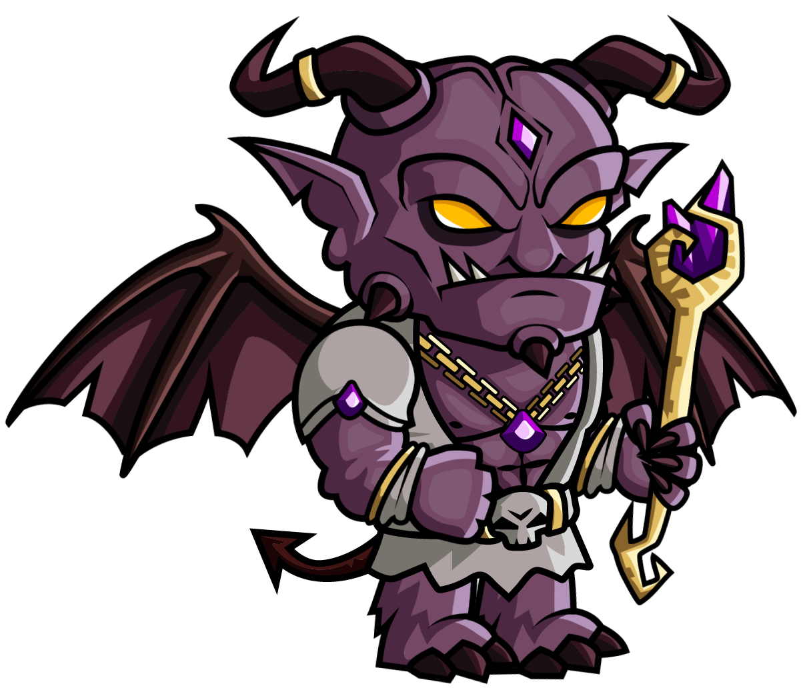
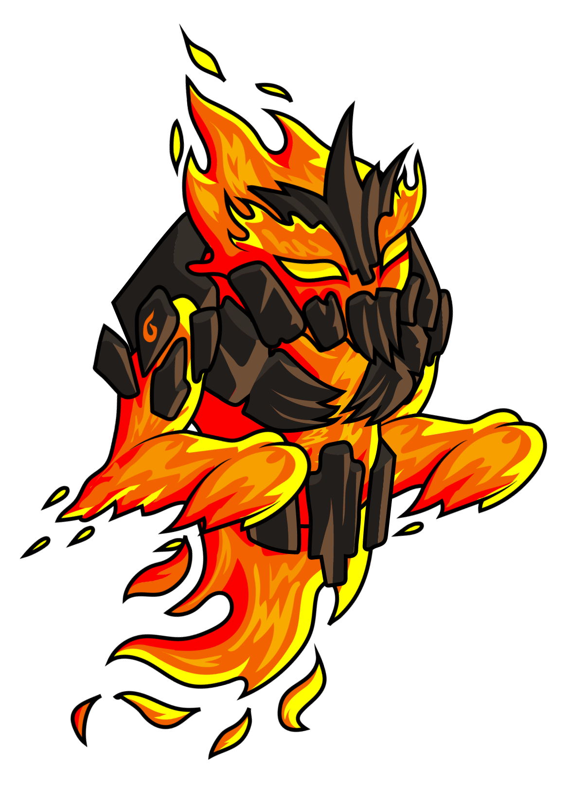
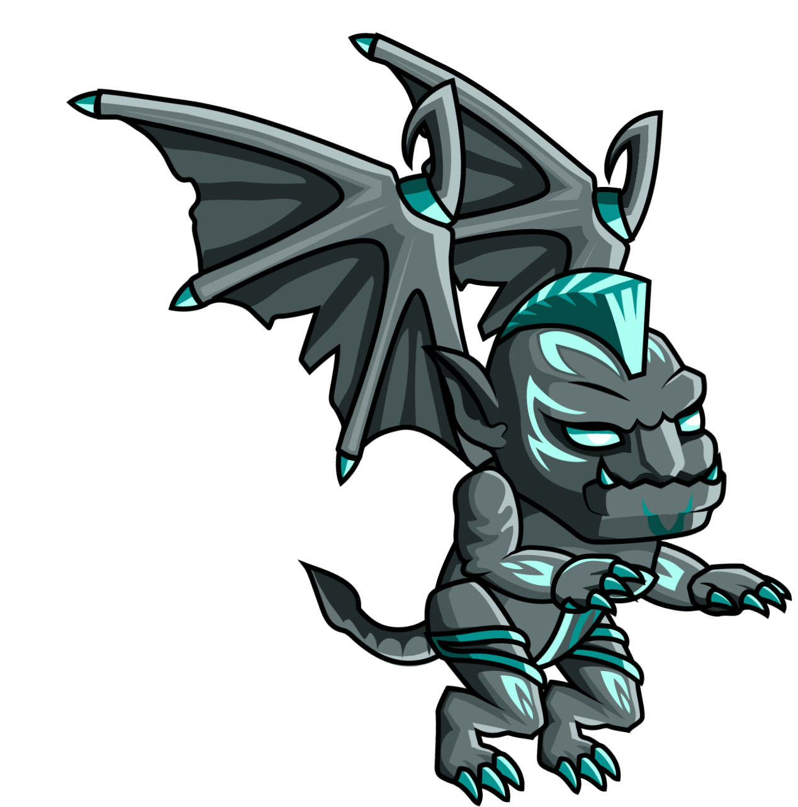
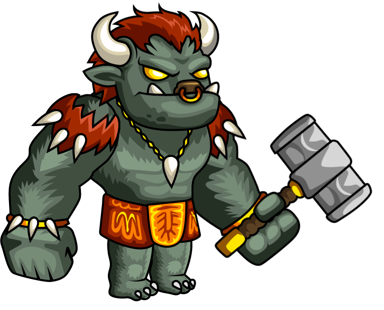
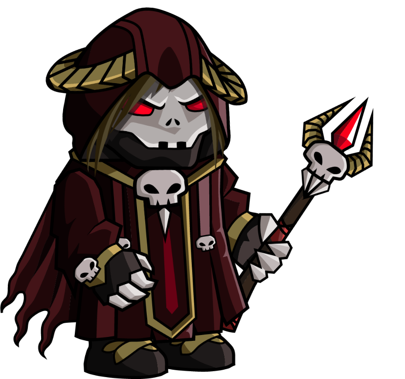
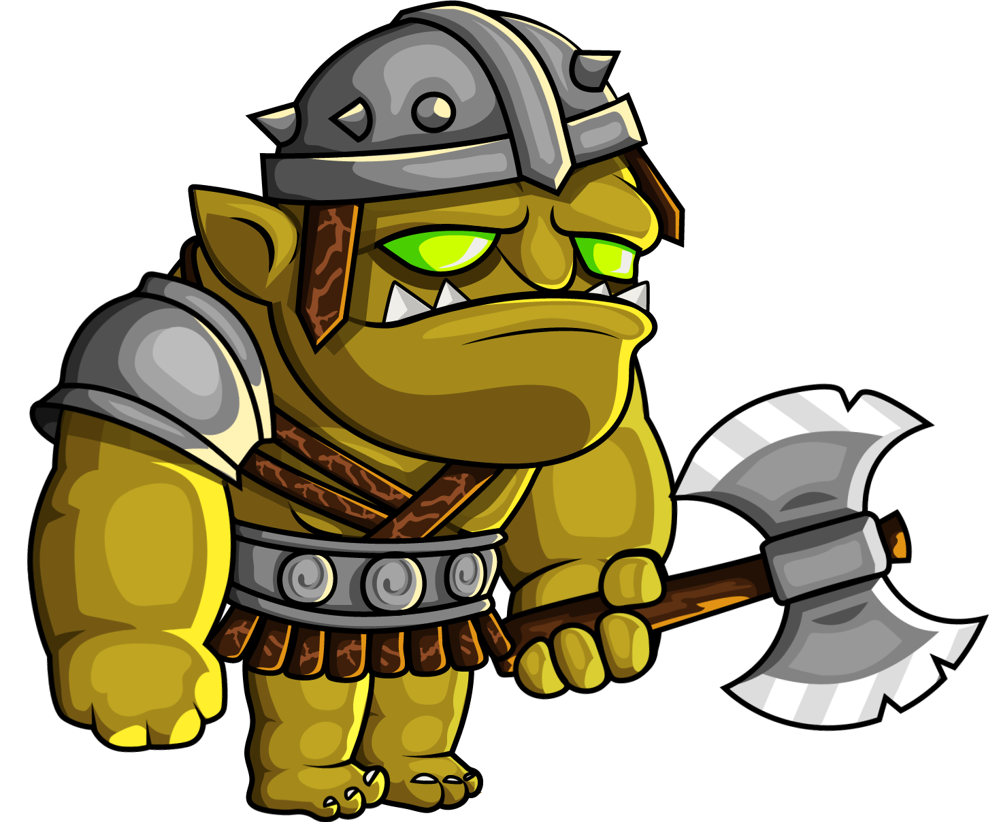
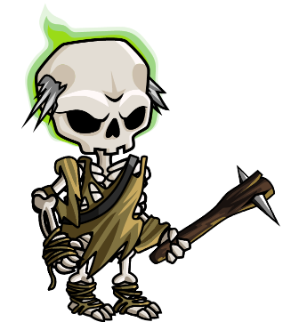

Útočníci
===========

.. |c| image:: _static/cyclop.png
    :width: 100pt

.. list-table:: **Kyklop**
   :widths: 50 150

   * - |c|
     - **Útok:** 20

       **Obrana:** 10

       **Dohled:** 3

       **Cena:** 60

       **Životy:** 80

       **Aktivní schopnost:** Žádná

       **Pasivní schopnost:** Nezapálitelný

       **Akce:** 2

       **Pohyb:** Nejbližsší jednotka

.. list-table:: **Démon**
   :widths: 50 150

   * - |d|
     - **Útok:** 25

       **Obrana:** 5

       **Dohled:** 3

       **Cena:** 80

       **Životy:** 150

       **Aktivní schopnost:** Zapálení

       **Pasivní schopnost:** Nezmrazitelný, nezapálitelný

       **Akce:** 2

       **Pohyb:** Nejbližší jednotka

.. list-table:: **Elemental**
   :widths: 50 150

   * - |e|
     - **Útok:** 10

       **Obrana:** 10

       **Dohled:** 2

       **Cena:** 35

       **Životy:** 60

       **Aktivní schopnost:** Zapálení

       **Pasivní schopnost:** Imunní vůči ohni

       **Akce:** 3

       **Pohyb:** Nejbližsí jednotka

.. list-table:: **Gargoil**
   :widths: 50 150

   * - |g|
     - **Útok:** 5

       **Obrana:** 10

       **Dohled:** 5

       **Cena:** 30

       **Životy:** 60

       **Aktivní schopnost:**

       **Pasivní schopnost:** Nezmrazitelný, létání

       **Akce:** 3

       **Pohyb:** Přímo na vesnici

.. list-table:: **Minotaur**
   :widths: 50 150

   * - |m|
     - **Útok:** 10

       **Obrana:** 20

       **Dohled:** 2

       **Cena:** 50

       **Životy:** 150

       **Aktivní schopnost:** Žádné

       **Pasivní schopnost:** Nesvazatelný

       **Akce:** 2

       **Pohyb:** Nejbližší jednotka

.. list-table:: **Nekromancer**
   :widths: 50 150

   * - |n|
     - **Útok:** 20

       **Obrana:** 5

       **Dohled:** 3

       **Cena:** 50

       **Životy:** 75

       **Aktivní schopnost:** Vyvolání kostlivce

       **Pasivní schopnost:** Nesvázatelný

       **Akce:** 3

       **Pohyb:** Nejbližsší jednotka

.. list-table:: **Ork**
   :widths: 50 150

   * - |o|
     - **Útok:** 8

       **Obrana:** 5

       **Dohled:** 3

       **Cena:** 8

       **Životy:** 35

       **Aktivní schopnost:** Žádná

       **Pasivní schopnost:** Žádná

       **Akce:** 2

       **Pohyb:** Přímo na vesnici

.. list-table:: **Kostlivec**
   :widths: 50 150

   * - |s|
     - **Útok:** 5

       **Obrana:** 2

       **Dohled:** 3

       **Cena:** 5

       **Životy:** 20

       **Aktivní schopnost:** Dva útoky

       **Pasivní schopnost:** Neoslepitelný

       **Akce:** 2

       **Pohyb:** Nejbližsší jednotka

