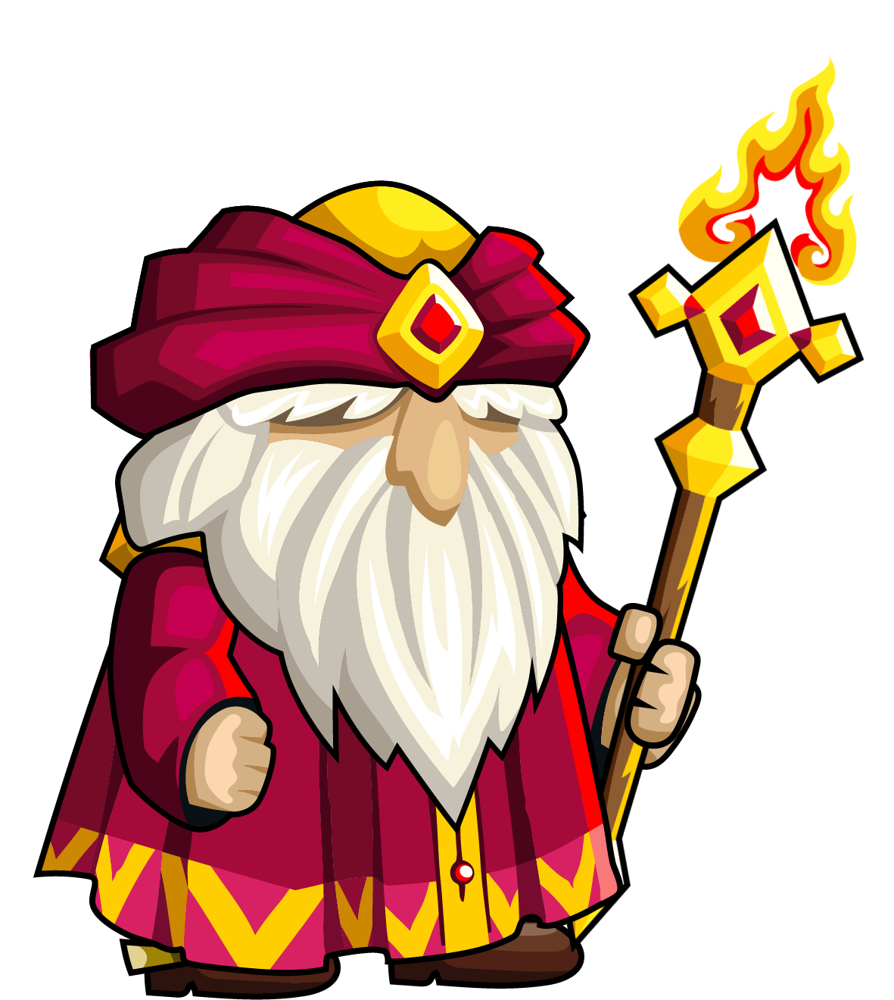
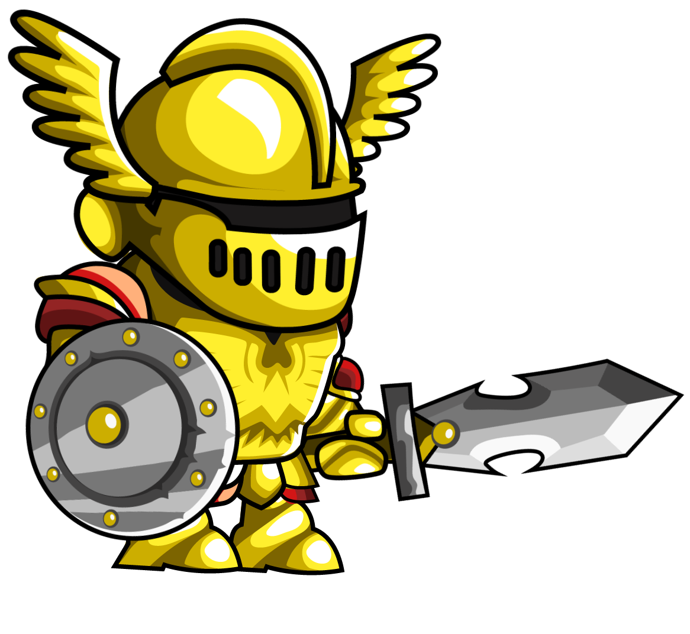

Obránci
===========

.. |a| image:: _static/archer.png
    :width: 100pt

.. |e| image:: _static/ent.png
    :width: 100pt

.. |d| image:: _static/druid.png
    :width: 100pt

.. list-table:: **Rytíř**
   :widths: 50 150

   * - |k|
     - **Útok:** 20

       **Obrana:** 20

       **Dohled:** 2

       **Cena:** 10

       **Životy:** 100

       **Aktivní schopnost:** Nablískaný štít - Oslepení

       **Pasivní schopnost:** Pevné brnění - Neoslabitelý

.. list-table:: **Kouzelník**
   :widths: 50 150

   * - |m|
     - **Útok:** 50

       **Obrana:** 5

       **Dohled:** 5

       **Cena:** 30

       **Životy:** 75

       **Aktivní schopnost:** Ohnivá koule - Zapálení

       **Pasivní schopnost:** Nehořlavý plášť - Nezapálitelný

.. list-table:: **Lučištník**
   :widths: 50 150

   * - |a|
     - **Útok:** 10

       **Obrana:** 5

       **Dohled:** 4

       **Cena:** 5

       **Životy:** 50

       **Aktivní schopnost:** -

       **Pasivní schopnost:** Neoslepitelný

.. list-table:: **Ent**
   :widths: 50 150

   * - |e|
     - **Útok:** 10

       **Obrana:** 50

       **Dohled:** 2

       **Cena:** 50

       **Životy:** 200

       **Aktivní schopnost:** Popínavé kořeny - oslabení

       **Pasivní schopnost:** Tvrdá kůra - nazmrazitelný

.. list-table:: **Druid**
   :widths: 50 150

   * - |d|
     - **Útok:** 30

       **Obrana:** 10

       **Dohled:** 6

       **Cena:** 25

       **Životy:** 100

       **Aktivní schopnost:** Tuhá zima - zmražení

       **Pasivní schopnost:** -

