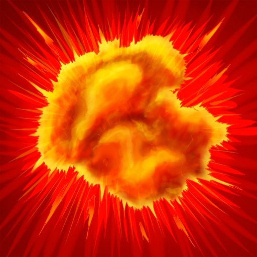

Efekty
========

.. |fr| image:: _static/freeze.png
    :width: 100pt

.. |r| image:: _static/roots.png
    :width: 100pt

.. |b| image:: _static/blind.png
    :width: 100pt

.. list-table:: **Oheň**
    :widths: 50 150

   * - |f|
     - **Popis:** Postava vzplane ohněm, který ji spaluje a postupně zabíjí

       **Efekt:** Postava ztrácí 5 životů za kolo

       **Rezistentní:**

       **Způsobují:**

.. list-table:: **Mráz**
    :widths: 50 150

   * - |fr|
     - **Popis:** Postava zažije mrazivé chvilky, bude chvíli trvat než se zahřeje

       **Efekt:** Postava je zpomalena na poloviční rychlost

       **Rezistentní:**

       **Způsobují:**

.. list-table:: **Kořeny**
    :widths: 50 150

   * - |r|
     - **Popis:** Kořeny se postavě ovinou kolem celého těla, špatně se s tím útočí

       **Efekt:** Postava ztrácí polovinu svého útoku

       **Rezistentní:**

       **Způsobují:**

.. list-table:: **Oslepení**
    :widths: 50 150

   * - |b|
     - **Popis:** Tak jasná záře se dá španě vydržet. Chvilku potrvá než uvidí normálně

       **Efekt:** Postava ztrácí půlku dohledu

       **Rezistentní:**

       **Způsobují:**