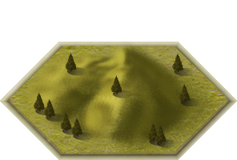
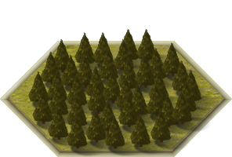
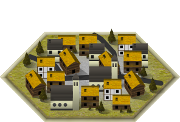

Mapa
========

.. list-table:: **Travnatá oblast**
   :widths: 50 150

   * - |g|
     - **Popis:** Trávou porostlá rovina, nudnější to bejt nemůže

       **Efekt:** Žádný

       **Bonus:** Žádný

.. list-table:: **Kopcovitá oblast**
   :widths: 50 150

   * - |h|
     - **Popis:** Malý kopeček na trávy, je z něj dobře vidět

       **Bonus:** Zvyšuje dohled o 2

       **Efekt:** Žádný

.. list-table:: **Hustý les**
   :widths: 50 150

   * - |f|
     - **Popis:** Hustý neprostupný les, určitě tě dobře skreje

       **Efekt:** Snižuje vzdálenost na kterou tě vidí o 2

       **Bonus:** Žádný

.. list-table:: **Vysoká hora**
   :widths: 50 150

   * - |m|
     - **Popis:** Tak vysoká hora, že na ní stěží vylezeš

       **Efekt:** Snižuje pohyb o 3

       **Bonus:** Zvyšuje dohled o 3

.. list-table:: **Řeka**
   :widths: 50 150

   * - |r|
     - **Popis:** Řeka která se težko přechází

       **Efekt:** Snižuje pohyb o 2

       **Bonus:** Žádný

.. list-table:: **Vesnice**
   :widths: 50 150

   * - |v|
     - **Popis:** Vesnice plná obyvatel, tu by si měl chránit

       **Efekt:** Zvyšuje obranu o 10

       **Bonus:** Žádný